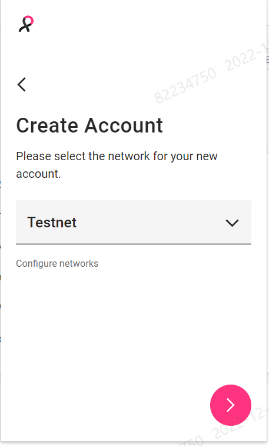
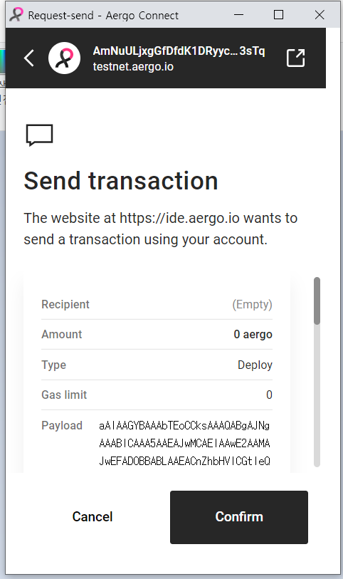

# aergo-lua

## 0. 시작하기

### Aergo Connect (크롬 확장프로그램) 사용

- testnet에서 사용하기로 설정

    

- passphrase(비밀번호?) 입력

    

- **Account 생성** : AmNuULjxgGfDfdK1DRyycaaExKcBYoBdAwpZEEMfeVRMb1q93sTq

  

- [faucet.aergoscan.io](https://faucet.aergoscan.io/) 에서 자금 조달
  _[참고](https://aergo.readthedocs.io/en/2.2/using-network/funding.html)_

     

  이후 [testnet](https://testnet.aergoscan.io/account/AmNuULjxgGfDfdK1DRyycaaExKcBYoBdAwpZEEMfeVRMb1q93sTq)에서 확인 가능
  

## 1. Hello World

### Aergo IDE 사용 (https://ide.aergo.io/)

- [helloworld.lua](/code/helloworld.lua) 작성
- aergo ide에서 open 또는 내용 작성 후 **deploy 클릭**

  

- confirm 클릭

  

- 계정으로 transaction 보내기

  

- 귀여운 고양이와 성공...
  

- testnet에서 확인 가능

  **계약 생성(Contract Creation)**
  

  ### transaction이 하나 더 생겼다

  

### 상세정보 살펴보기
