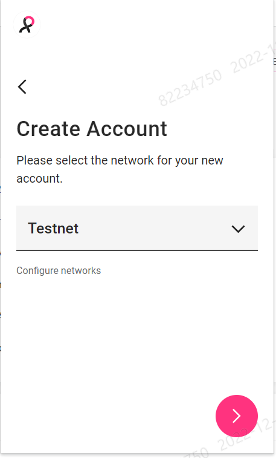
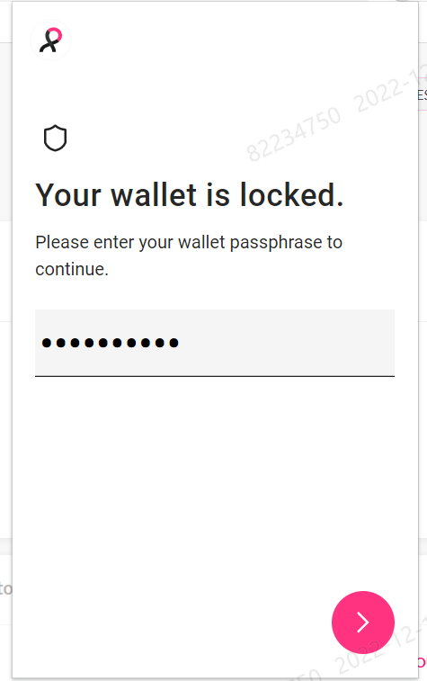
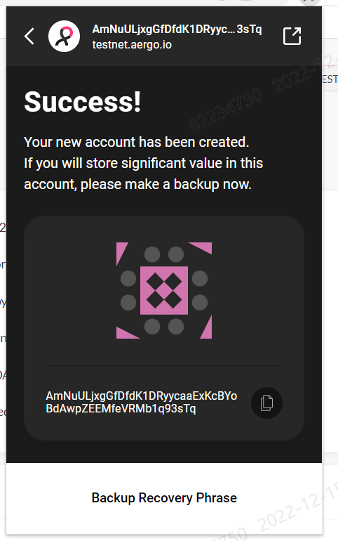
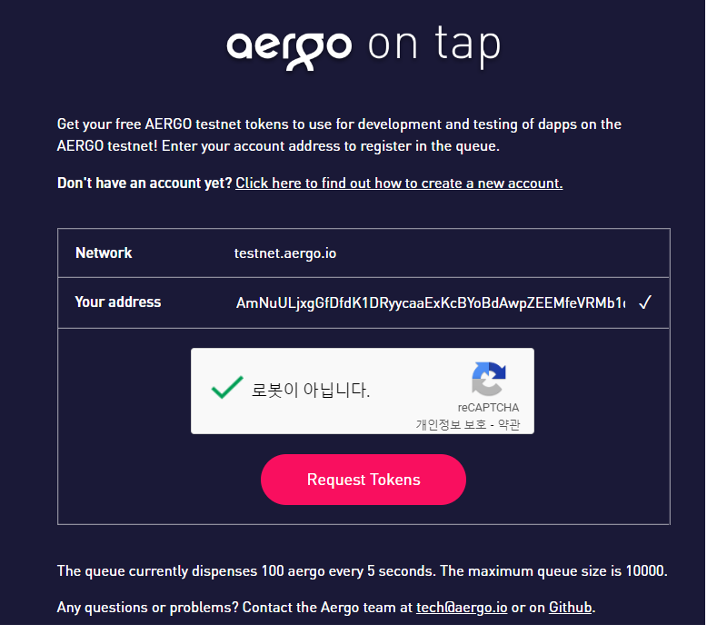
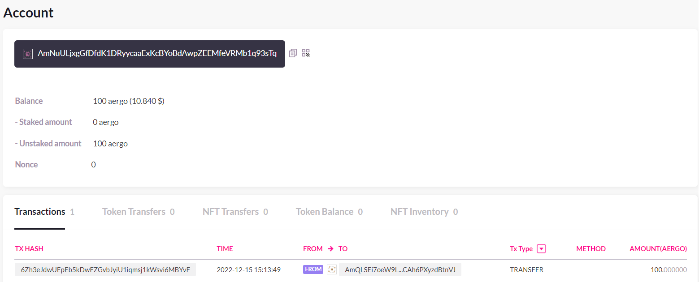

# 시작하기

### Aergo Connect (크롬 확장프로그램) 사용

- testnet에서 사용하기로 설정

    

- passphrase(비밀번호?) 입력

    

- **Account 생성** : AmNuULjxgGfDfdK1DRyycaaExKcBYoBdAwpZEEMfeVRMb1q93sTq

  

- [faucet.aergoscan.io](https://faucet.aergoscan.io/) 에서 자금 조달
  _[참고](https://aergo.readthedocs.io/en/2.2/using-network/funding.html)_

     

  이후 [testnet](https://testnet.aergoscan.io/account/AmNuULjxgGfDfdK1DRyycaaExKcBYoBdAwpZEEMfeVRMb1q93sTq)에서 확인 가능
  
