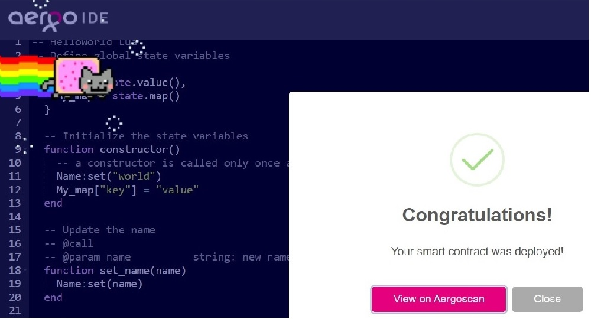

# Hello World

### Aergo IDE 사용 (https://ide.aergo.io/)

- [helloworld.lua](/code/helloworld.lua) 작성
- aergo ide에서 open 또는 내용 작성 후 **deploy 클릭**

      ~/aergocli contract deploy ($account) --payload ($payload)

  

- confirm 클릭

  

- 계정으로 transaction 보내기

  

- 귀여운 고양이와 성공...
  

- [testnet](https://testnet.aergoscan.io/account/AmNuULjxgGfDfdK1DRyycaaExKcBYoBdAwpZEEMfeVRMb1q93sTq)에서 확인 가능

  **계약 생성(Contract Creation)**
  

  ### transaction이 하나 더 생겼다

  

### 상세정보 살펴보기

- testnet에서 생성된 계약의 상세 정보를 볼 수 있다.

  ###### payload(사용에 있어서 전송되는 데이터)

  

  

  
json 부분을 펼쳐보면..

      {
          "version": "0.2",
          "language": "lua",
          "functions": [
              {
                  "name": "hello",
                  "arguments": []
              },
              {
                  "name": "set_name",
                  "arguments": [
                      {
                          "name": "name"
                      }
                  ]
              },
              {
                  "name": "constructor",
                  "arguments": []
              }
          ],
          "state_variables": [
              {
                  "name": "Name",
                  "type": "value"
              },
              {
                  "name": "My_map",
                  "type": "map"
              }
          ]
      }

  

  - 작성했던 function : constructor, set_name, hello 확인가능
  - state_variables 구성요소 : Name, My_map 확인가능

   

- 그리고 결과

      ~/aergocli receipt get ($account) -H testnet.aergo.io

  

  contract 실제 주소 (contractaddress 필드) : [AmgRDjk7RVEHQXbFtqmT6cTtXxnciZE2zkuhQG3qhhNnxWvxN37w](https://testnet.aergoscan.io/account/AmgRDjk7RVEHQXbFtqmT6cTtXxnciZE2zkuhQG3qhhNnxWvxN37w?keyword=AmgRDjk7RVEHQXbFtqmT6cTtXxnciZE2zkuhQG3qhhNnxWvxN37w)

- contract의 abi 확인

      ~/aergocli contract abi ($account) -H testnet.aergo.io

  

  
testnet에서도 얻을 수 있다

  [testnet](https://testnet.aergoscan.io/account/AmgRDjk7RVEHQXbFtqmT6cTtXxnciZE2zkuhQG3qhhNnxWvxN37w?keyword=AmgRDjk7RVEHQXbFtqmT6cTtXxnciZE2zkuhQG3qhhNnxWvxN37w)

      {
        "language": "lua",
        "version": "0.2",
        "functions": [
          {
            "name": "hello",
            "arguments": [],
            "view": false,
            "payable": false,
            "feeDelegation": false
          },
          {
            "name": "set_name",
            "arguments": [
              {
                "name": "name"
              }
            ],
            "view": false,
            "payable": false,
            "feeDelegation": false
          },
          {
            "name": "constructor",
            "arguments": [],
            "view": false,
            "payable": false,
            "feeDelegation": false
          }
        ],
        "state_variables": [
          {
            "name": "Name",
            "type": "value",
            "len": 0
          },
          {
            "name": "My_map",
            "type": "map",
            "len": 0
          }
        ]
      }

  

  **abi**

- testnet에서 쿼리 실행하기

  - **hello** 함수를 실행하면 :

    기존에 저장되어있던 Name _world_ 와 함께 _hello world_ 출력

         ~/aergocli contract query ($account) -H testnet.aergo.io hello

    

 
  - 이제 Name을 바꿔보자..
