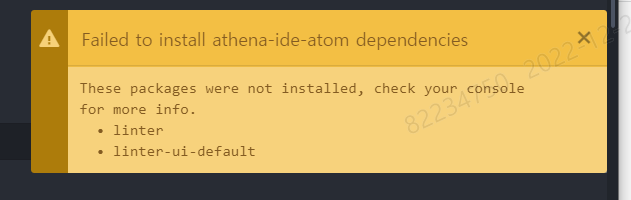
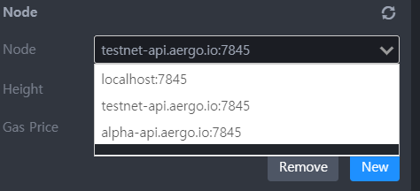
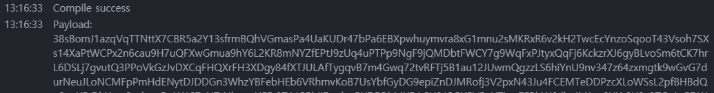

# Aergo JDBC 과정 1일차

## 1. Atom 설치

- 석양의 아톰..

  2022년 12월 15일 [Atom 종료](https://github.blog/2022-06-08-sunsetting-atom/)

  → [아톰 깃허브](https://github.com/atom/atom/releases/tag/v1.37.0)에서 **AtomSetup-x64.exe**
  다운로드 후 설치

  버전 : 1.37.0

   

- athena-ide-atom 패키지 [설치](https://aergo-athena.readthedocs.io/ko/develop/getting-started/index.html#install)

  - 첫번째 방법 (실패)

    패키지 설치탭에서 검색이 되지 않는다..

    

  - 두번째 cli로 수동설치 (실패)

    C:\Users \ {유저이름} \ .atom \ packages 폴더에서 git bash here

    > apm install athena-ide-atom

    

    오류가 발생한다

  - 마지막 방법 설치파일로 수동설치 진행

    [release](https://github.com/aergoio/athena-ide-atom/releases) 에서 **athena-ide-atom-0.5.2-installer.bin** 다운로드

    C:\Users \ {유저이름} \ .atom \ packages 로 파일 옮기기

    packages 폴더에서 git bash here

    > ./athena-ide-atom-0.5.2-installer.bin

    

    설치되고 athena-ide-atom 폴더가 생성된다~

  - 또는! 폴더 옮기기

    [release](https://github.com/aergoio/athena-ide-atom/releases) 에서 **source code.zip** 다운로드

    C:\Users \ {유저이름} \ .atom \ packages 에 압축 풀기

    atom - packages에서 설치된 패키지를 볼 수 있다.

   

  ※ Request for package information failed: unable to verify the first certificate (UNABLE_TO_VERIFY_LEAF_SIGNATURE) **오류 발생시**

  관리자 권한으로 cmd 열고

  > npm config set strict-ssl false

  ※ Incompatible Packages **오류 발생시???**

   

  - 설치 후 아톰 오픈!

      

    이런게 떠서 Yes를 눌러봤지만.. 설치에 실패했다.

    쓰는데 지장은 없는듯하다

      

      

    Packages에 Athena IDE가 잘 뜨는 것을 볼 수 있다!

   

## 2. 실습 따라하기

아톰에서 \Archive\1일차 폴더를 열고 Athena IDE 탭을 열어준다.

  

   

- Node 에서 테스트 노드 연결 확인

  
  

  없으니까 **New** 버튼을 통해 등록한다.

   

- Account 에서 계정 생성

  **New** 버튼 클릭

  

  계정 : AmPvVz11yWkZ2wuY1DeM5cd15DpbYsJ9Zfr6WXqAh2hWoRpkYikM

   

  **password** 입력 후 **Export** 버튼으로 암호화된 개인키 얻기

  

  Export 후 ide 콘솔에 암호화된 개인키 출력 47zGxszhmXzVuuWB8eFGJsqTYh2dEgQHVjK8MukpMzYeADrhhxS9cxKSjt5xauUPa2NVuFfn9

  

   

  - 스마트계약 배포 파일 생성하기

    sample.lua + db-1.2.0.lua = test.lua

    ※ sample.lua 파일로 컴파일 하려면 [db-1.2.0.lua](https://github.com/aergoio/aergojdbc) 파일이 있어야한다.

    test.lua 파일만으로도 컴파일 가능 (둘이 합쳐진 파일)

     

  - 배포 전 컴파일

    sample.lua 에서 **Compile Smart Contract** 클릭

    

    ide 콘솔에 결과 출력. testnet에서처럼 abi도 나옴..
    
    

  - 그다음 **deploy**

    

    에러발생 Error: 14 UNAVAILABLE: DNS resolution failed

    deploy하면 얻어지는 contract address가 있을것이다..

## 3. DBeaver 활용하기

- DBeaver [설치](https://dbeaver.io/download/)

- 입력하라는대로 입력

  새 데이터베이스 연결 - SQLite 선택

  Driver Settings 에서

  **URL Template** : jdbc:aergo:alpha1.aergo.io:7845@{스마트컨트랙트 주소}

  **Default Port** : 7845

  (No authentication 체크해제해야 Username, Password 입력할 수 있다.)

    

  Libraries 탭에서

  **Add File** - aergojdbc-1.2.0.jar 선택

  **Find Class**로 Driver class 선택

    
    
  **Username** : 암호화된 개인키

  **Password** : 암호화된 개인키 받을때 입력한 비밀번호

    

  그리고 Test Connection... 하면.... 되야되는데......
