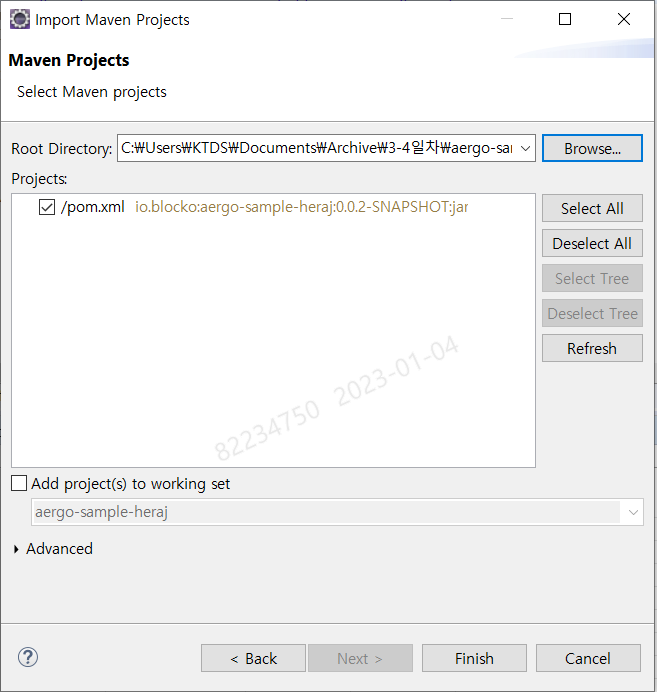
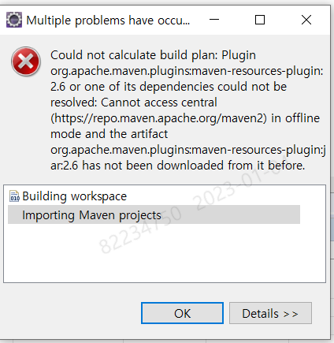
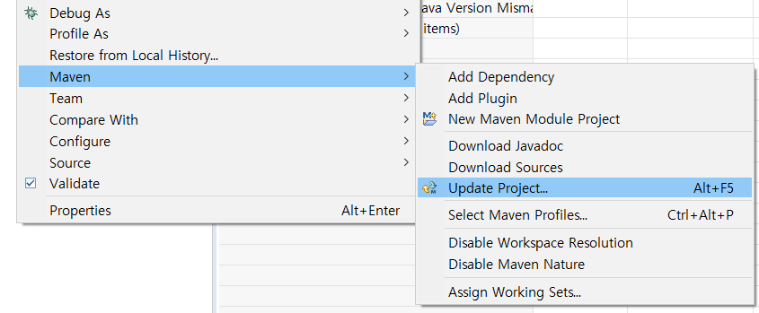
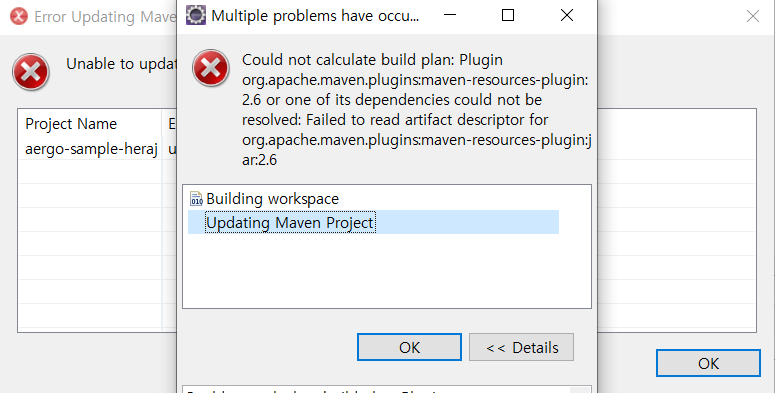

# Aergo Platform

## Consensus (합의)

### DPos

: 위임 지분 증명 합의 알고리즘

토큰 보유자가 투표를 통해 대표자 선출

대표자들간에 합의를 통해 블록의 생성과 검증을 진행

23개 BP(Block Producer)에 의해 생성, 검증.

BP 노드들이 설정된 Interval에 맞춰 순차적으로 블록 생성.

Fork, Reorganization 허용.

### LPoA

: 대표자 기반 권한 증명 알고리즘

Raft 프로토콜을 이용해 리더 선출

선출된 리더가 mining 권한으로 블록 생성

순차적으로 블록 생성 x. 특정노드만 생성.

Fork 없음.

과반수 노드가 살아있어야 동작

 

## Naming System

: 블록체인 주소에 사람이 인식하기 쉬운 Name 부여

블록체인 주소 : hash형태의 문자열

account address, smart contract 에 가능

 

## Testnet / SQL Testnet

### Testnet

: SQL 모듈 사용할수없음.. 스마트컨트랙트에서 SQL 사용하려면 SQL Test Net 사용..

 

# Data Structure

## Block Data Structure

: Header + Body

### Header

- Chain Id : 체인 식별자.
  - 현재 사이드 체인의 버전정보
  - 퍼블릭/메인넷 여부
  - Transaction Fee
  - Consensus Type (DPos/LPoA)
- PrevBlockHash
- BlockNo
- TimeStamp
- BlocksRootHash
- TxsRootHash
- ReceiptsRoot Hash
- Confirms : DPoS에서 몇개 BP가 블록을 confirm 했는지
- PubKey : 블록을 생성한 BP의 공개키
- CoinbaseAccount : 블록생성시 발생한 보상을 전달할 계정
- Sign : 블록을 생성한 BP의 전자서명

### Body

여러개의 Transaction으로 구성?

## Transaction Data Structure

: Body + Body의 Hash

### Body

- Nonce : 보내는 account의 인덱스
- Account : 보내는 account
- Recipient : 받는 account
- Amount
- Payload : Smart Contract data, User Defined string data
- Limit
- Price
- Type (Normal/Governance)
- Sign

 

# 개발환경

## Heraj

: Aergo SDK for Java

java 1.8이상 권장

Maven/Gradle로 설치 가능 (외부인터넷 사용이 불가한 경우에는 버전에 맞는 라이브러리 다운 후 빌드패스 설정..)

## Herajs

: Aergo SDK for Javascript

프론트엔드에서 transaction, smart contract를 편리하게 사용하기 위한 라이브러리

    npm install --save @herajs/client 로 설치

## Athena

: Atom IDE plugin

아톰에서 사용할 수 있는 플러그인 형태의 툴. [석양의아톰](./2.md)

## aergoluac

: Lua Script를 deploy 하기위해 ByteCode로 변환 필요

sdk를 통해 직접 배포할 경우 aergoluac를 통해 변환 후 사용

    > aergoluac test.lua test.bc -a test.abi //파일로 출력하여 저장 test.bc? test.abi?

    > aergoluac test.lua --payload //콘솔에 바로 출력

 

# 샘플코드 실행시켜보기 (실패)

## JDK & 이클립스 설치

[openJDK 1.8](https://github.com/ojdkbuild/ojdkbuild) 이상과 이클립스 알아서 설치한다

## [샘플코드](https://drive.google.com/file/d/1y_cqtIPDHLhv7JikY8c35ZQ-wF7g2abX/view?usp=sharing) 시작하기

Maven Project 형식으로 import

오류가 발생하기 시작..

Maven Update 실행.. 실패...

메이븐 프로젝트를 새로 만들어보기로 도전..

뭐 볼필요도 없이 실패!

### 실패 원인은..

maven plugin을 받아오지 못하는것 아닐까..

외부망이 되긴하지만 plugin설치 등등 받아오는게 안되는듯

그렇다면 nexus를 해서.. 하는 방법이 있다고하는데......

잘 되는 사람의 repository를 옮겨오는 방법도 있다고한다. (이걸 해봐야지)
