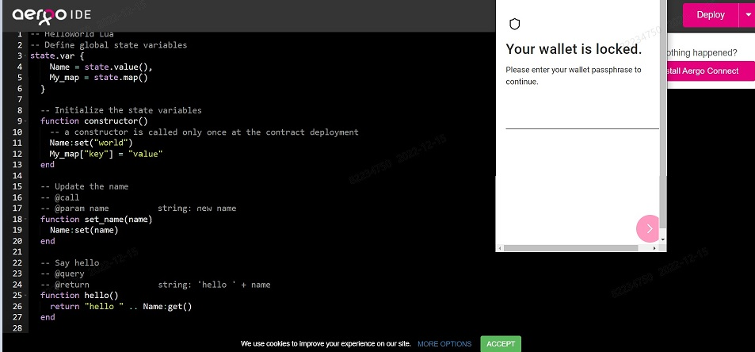
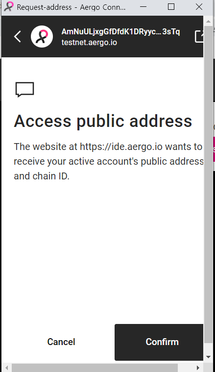
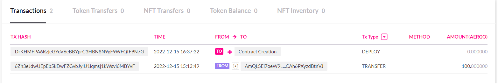
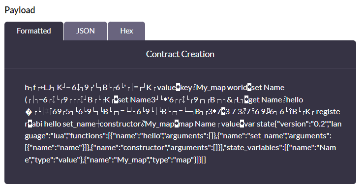
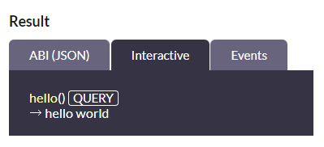

# Hello World 튜토리얼 따라하기

### Aergo IDE 사용 (https://ide.aergo.io/)

- [helloworld.lua](/md/helloworld.lua) 작성
- aergo ide에서 open 또는 내용 작성 후 **deploy 클릭**

      ~/aergocli contract deploy ($account) --payload ($payload)

  

- confirm 클릭

  

- 계정으로 transaction 보내기

  

- 귀여운 고양이와 성공...
  

- [testnet](https://testnet.aergoscan.io/account/AmNuULjxgGfDfdK1DRyycaaExKcBYoBdAwpZEEMfeVRMb1q93sTq)에서 확인 가능

  **계약 생성(Contract Creation)**
  

  ### transaction이 하나 더 생겼다

  

### 상세정보 살펴보기

- testnet에서 생성된 계약의 상세 정보를 볼 수 있다.

  ###### payload(사용에 있어서 전송되는 데이터)

  

  

  
json 부분을 펼쳐보면..

      {
          "version": "0.2",
          "language": "lua",
          "functions": [
              {
                  "name": "hello",
                  "arguments": []
              },
              {
                  "name": "set_name",
                  "arguments": [
                      {
                          "name": "name"
                      }
                  ]
              },
              {
                  "name": "constructor",
                  "arguments": []
              }
          ],
          "state_variables": [
              {
                  "name": "Name",
                  "type": "value"
              },
              {
                  "name": "My_map",
                  "type": "map"
              }
          ]
      }

  

  - 작성했던 function : constructor, set_name, hello 확인가능
  - state_variables 구성요소 : Name, My_map 확인가능

   

- 그리고 결과

      ~/aergocli receipt get ($account) -H testnet.aergo.io

  

  contract 실제 주소 (contractaddress 필드) : [AmgRDjk7RVEHQXbFtqmT6cTtXxnciZE2zkuhQG3qhhNnxWvxN37w](https://testnet.aergoscan.io/account/AmgRDjk7RVEHQXbFtqmT6cTtXxnciZE2zkuhQG3qhhNnxWvxN37w?keyword=AmgRDjk7RVEHQXbFtqmT6cTtXxnciZE2zkuhQG3qhhNnxWvxN37w)

- contract의 abi 확인

      ~/aergocli contract abi ($contract_account) -H testnet.aergo.io

  

  
testnet에서도 얻을 수 있다

  [testnet](https://testnet.aergoscan.io/account/AmgRDjk7RVEHQXbFtqmT6cTtXxnciZE2zkuhQG3qhhNnxWvxN37w?keyword=AmgRDjk7RVEHQXbFtqmT6cTtXxnciZE2zkuhQG3qhhNnxWvxN37w)

      {
        "language": "lua",
        "version": "0.2",
        "functions": [
          {
            "name": "hello",
            "arguments": [],
            "view": false,
            "payable": false,
            "feeDelegation": false
          },
          {
            "name": "set_name",
            "arguments": [
              {
                "name": "name"
              }
            ],
            "view": false,
            "payable": false,
            "feeDelegation": false
          },
          {
            "name": "constructor",
            "arguments": [],
            "view": false,
            "payable": false,
            "feeDelegation": false
          }
        ],
        "state_variables": [
          {
            "name": "Name",
            "type": "value",
            "len": 0
          },
          {
            "name": "My_map",
            "type": "map",
            "len": 0
          }
        ]
      }

  

  **abi**

- [testnet](https://testnet.aergoscan.io/account/AmgRDjk7RVEHQXbFtqmT6cTtXxnciZE2zkuhQG3qhhNnxWvxN37w?keyword=AmgRDjk7RVEHQXbFtqmT6cTtXxnciZE2zkuhQG3qhhNnxWvxN37w)에서 쿼리 실행하기

  - **hello** 함수를 실행하면 (query 클릭) :

    기존에 저장되어있던 Name _world_ 와 함께 _hello world_ 출력

    데이터 출력만 하므로 **query**

        ~/aergocli contract query ($contract_account) -H testnet.aergo.io hello

    
     
     

  - 이제 Name을 바꿔보려고 하는데..

    

    _set not permitted in query_

    set 권한이 없다고? 나한테? 원래 set이 안되나?
    아무튼 되질않는다..

    aergocli에서 실행하면 되겠지.. 하지만 aergocli도 어디서 해볼수있는지 모르겠다 ~~도커시러우분투시러~~

    데이터를 변경하므로 **call**

        ~/aergocli contract call ($account) ($contract_account) -H testnet.aergo.io set_name '["aergo"]'

    여기서 이름을 aergo로 바꾸고 나서 hello 함수를 실행하면 _hello aergo_ 가 출력된다..

- 생성된 transaction 확인!

  [testnet](https://testnet.aergoscan.io/account/AmNuULjxgGfDfdK1DRyycaaExKcBYoBdAwpZEEMfeVRMb1q93sTq/)에서 계정정보를 확인해보면

    

  3개가 있는걸 볼 수 있는데 밑에서 부터

  1. 처음 계정을 생성하고 테스트 코인을 받은 것
  2. 스마트 계약 생성
  3. 다른계정에서 이 계정으로 1aergo 보내본 것..

  ~~(원래는 name 변경 함수로 하나 더 만들고싶었다ㅠㅠ)~~
